# Comparative Time Series Analysis and Forecasting of Mobile Network Traffic

**Machine Learning Techniques I — Formative Assignment 1

**GitHub repository:** [https://github.com/jbyiringiro/ml-tech-I-formative1](https://github.com/jbyiringiro/ml-tech-I-formative1)
**Demo Video:** 

## Introduction

Mobile network operators must anticipate how data traffic varies over space and
time in order to dimension capacity, plan maintenance and manage energy use.
This assignment studies **mobile Internet traffic in the city of Milan** and
builds short-term forecasting models for it.

The dataset, released by Telecom Italia Mobile (TIM) for the "Big Data
Challenge" and documented by Barlacchi *et al.* [1], records mobile network
activity over a **100 × 100 grid of 10,000 geographical areas** ("squares") at
a **10-minute resolution** for the two months of **November–December 2013**.
Traffic is measured as the number of Call Detail Records (CDRs) generated by
mobile Internet sessions, a well-established proxy for the spatio-temporal
dynamics of data volume [1].

The work is organised into three tasks:

1. **Data handling & memory management** — load and process the ~19 GB raw
   dataset within the memory budget of a typical laptop.
2. **Exploratory data analysis** — characterise the temporal, spatial and
   statistical properties of the traffic.
3. **Forecasting** — design, implement and compare three one-step-ahead
   forecasting models (SARIMA, LSTM, GRU) on three selected areas for the test
   week of **16–22 December 2013**.

The objective is not only to obtain accurate forecasts but to *justify* every
design decision with evidence from the data and from the literature.

---

## Task 1: Data Handling and Memory Management

### 1.1 The challenge

The raw dataset is delivered as **61 daily tab-separated text files** (one per
day, November–December 2013), each roughly 300–360 MB, **~19 GB in total**.
Each line reports activity for one `(square, 10-minute interval, country code)`
combination, with eight fields. Loading all of this into memory at once with
default `pandas` dtypes is infeasible on the 8–16 GB of RAM available on a
typical laptop, so a deliberate memory-management strategy is required.

### 1.2 Loading and processing strategy

The strategy (implemented in `src/data_loading.py`) combines four techniques:

**(a) Stream file-by-file.** Each daily file is read, transformed and reduced
independently; at no point is more than one day held in memory. This bounds
peak RAM by the size of a *single* day rather than the whole dataset.

**(b) Column pruning.** Only three of the eight columns are relevant — `Square id`, `Time interval` and `Internet traffic activity`. Using `pandas`'
`usecols` argument, the SMS, call and country-code columns are never
materialised, eliminating roughly 60 % of the I/O and memory cost. (Note the
documented field-order correction in [1]: the country code is the *third*
field.)

**(c) Dtype downcasting.** Default `pandas` dtypes are wasteful:

| Column        | Default dtype | Optimised dtype         | Justification                       |
| ------------- | ------------- | ----------------------- | ----------------------------------- |
| `square_id` | int64 (8 B)   | **uint16 (2 B)**  | ids span 1–10,000 < 65,535         |
| `internet`  | float64 (8 B) | **float32 (4 B)** | CDR counts need no double precision |
| `timestamp` | int64 (8 B)   | datetime64              | parsed from epoch-milliseconds      |

Downcasting roughly **halves** the per-column footprint with no loss of
information relevant to the analysis.

**(d) Early aggregation.** Each file contains one row per country code; we
immediately `groupby(['square_id','time'])` and **sum** the Internet activity,
collapsing the data to one value per `(square, interval)`. This both reduces
row count and produces the quantity of interest (total traffic per area).

The consolidated result is a **wide traffic matrix** (rows = 10-minute
timestamps, columns = square ids, values = total traffic, `float32`), written
to disk as a **compressed Parquet** file. Parquet is columnar and compressed,
so it is far smaller and faster to reload than CSV/TSV and preserves dtypes.

### 1.3 Memory usage: before vs after

The table below (generated by `memory_comparison()` on the 1 November daily
file; saved to `results/tables/task1_memory_comparison.csv`) quantifies the
optimisation:

| Load strategy                            | Rows      | Cols | In-memory size           |
| ---------------------------------------- | --------- | ---- | ------------------------ |
| Naive (8 cols, int64/float64)            | 4,842,625 | 8    | **295.57 MB**      |
| Optimised (3 cols, downcast + aggregate) | 1,439,982 | 3    | **19.23 MB**       |
| **Reduction**                      | —        | —   | **93.5 % smaller** |

The optimised load is **~15× smaller** than the naive one. Two effects
combine: column pruning + downcasting shrink each surviving value, and the
country-code aggregation collapses 4.84 M raw rows to 1.44 M
(= 10,000 areas × 144 intervals). For the **full dataset**, the
streaming-and-aggregate design turns **19.38 GB of raw text on disk** into an
in-memory matrix of only **335 MB** (8,784 timestamps × 10,000 areas × 4 bytes
`float32`) — small enough to analyse comfortably. It is stored as a **460.6 MB
Parquet** file (≈42× smaller than the raw text, with dtypes preserved and
near-instant reload). The full 62-file consolidation completed in **113 s**.

### 1.4 Challenges encountered

- **Field-order ambiguity.** The original paper [1] mis-states the column
  order; we follow the documented correction and verified the column choice by
  inspecting a sample file.
- **Missing values.** Some records have an empty Internet field. An absent
  record means *no measured activity*, so missing values are treated as zero
  (`fillna(0)`), consistent with the CDR semantics.
- **Timezone alignment.** The raw timestamps are Unix epoch-milliseconds in
  **UTC**, but the daily files are aligned to **CET local midnight** (verified:
  the first interval of the 1 Nov file is epoch `1383260400000` = 31 Oct 23:00
  UTC = 1 Nov 00:00 CET). A fixed **+1 h** offset was applied so that the
  calendar windows — the first two weeks and the 16–22 Dec test week — refer to
  correct local dates. Italy observes no daylight saving in Nov–Dec, so a
  constant offset is exact.
- **Memory pressure during consolidation.** Building the wide matrix by
  concatenating per-day pivots keeps peak memory low; an alternative full
  long-format frame (~88 M rows) was rejected as unnecessarily large.
- **Download logistics.** Harvard Dataverse caps ZIP downloads at ~2.5 GB, so
  the 19 GB had to be retrieved in batches.

### 1.5 Hardware and software setup

The environment is reported automatically by `src.utils.print_system_report()`
at the start of every run:

| Component     | Specification                                                                        |
| ------------- | ------------------------------------------------------------------------------------ |
| CPU           | Intel64 Family 6 (16 logical cores)                                                  |
| RAM           | 31.4 GB                                                                              |
| GPU           | none — CPU-only (TensorFlow has no native-Windows GPU support ≥ 2.11)              |
| OS            | Windows 11 (10.0.26200)                                                              |
| Python        | 3.13.9                                                                               |
| Key libraries | pandas 2.3.3, NumPy 2.3.5, statsmodels 0.14.5, scikit-learn 1.7.2, TensorFlow 2.21.0 |

With 31.4 GB of RAM a naive full load of the 19.4 GB raw text *might* have just
fit, but it would have left almost no headroom and would not scale to a larger
city or a longer period; the streaming-and-aggregate strategy is therefore the
more robust and scalable design. The absence of a GPU (TensorFlow ≥ 2.11 has no
native-Windows GPU support) means the neural models are trained on CPU — still
fast at this data scale, as the timing table in §3.10 shows.

## Task 2: Exploratory Data Analysis

All figures are produced by `scripts/run_task2.py` from the consolidated
traffic matrix.

### 2.1 Distribution of per-area traffic

**Figure 1** (`task2_01_traffic_pdf.png`) shows the probability density of the
**total two-month traffic per area**, computed over all 10,000 areas, on linear
and logarithmic axes.

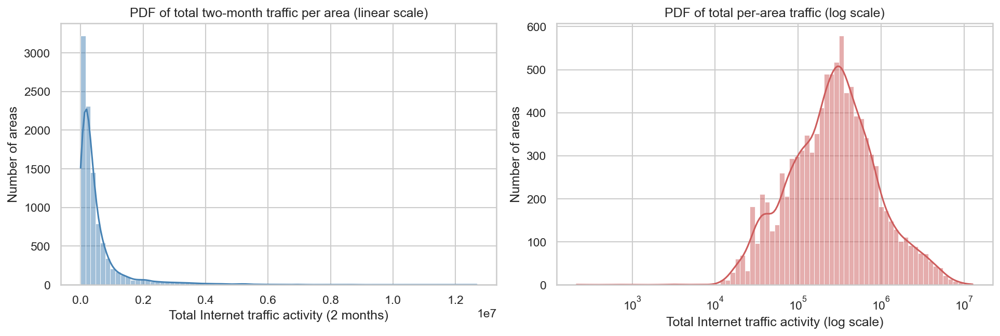

**Interpretation.** The distribution is **strongly right-skewed and
approximately log-normal** — on the linear axis ~3,200 areas fall in the lowest
bin, while on the log axis the distribution becomes a roughly bell-shaped
curve. The summary statistics confirm the heavy tail: **skewness 4.28**,
**excess kurtosis 25.7**, mean (549,973) more than double the median
(274,706), and a **p95/median ratio of 7.8**. The busiest area carries
**12.7 M** units of two-month traffic versus a minimum of only ~214 — a
**~59,000×** spread. This *heterogeneity* is expected: mobile traffic tracks
human density and activity, which in a city concentrates in business and
commercial districts. Such heavy-tailed, near-log-normal behaviour is a
recurring finding in urban telecom-traffic studies [1].

### 2.2 Temporal behaviour of the three target areas

**Figure 2** (`task2_02_area_timeseries.png`) shows traffic during the **first
two weeks** for the three areas analysed throughout the assignment: the
**highest-traffic area, Square id 5161** (the Milan city centre), and the fixed
areas **4159** and **4556**.

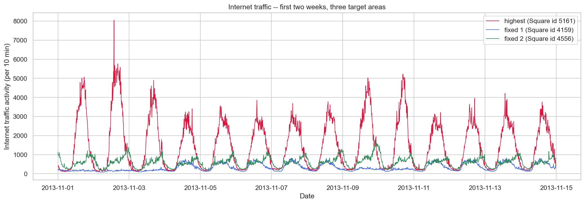

**Interpretation.** All three series exhibit a pronounced **daily cycle** (low
overnight, rising in the morning, peaking in the day/evening) and a visible
**weekday/weekend contrast** (the cluster of lower peaks every 6–7 days). The
areas differ chiefly in *amplitude*: area 5161 peaks at **~5,000–8,000** units
per 10 minutes with sharp, tall daytime peaks, area 4556 is intermediate
(~1,000–2,000), and area 4159 is the quietest (~500–1,500) with a flatter
profile. The dominant central area (5161) also shows the largest weekday/
weekend swing. These differences plausibly reflect land use — an intensely
commercial/visited city-centre cell versus quieter, more residential
peripheral cells — and the shared daily shape reflects the common rhythm of
human activity across the city.

### 2.3 Stationarity analysis

A series is **stationary** if its statistical properties (mean, variance,
autocorrelation) do not change over time — a prerequisite for ARIMA-family
models. We assess it two ways.

**Rolling statistics** (**Figure 3**, `task2_03_stationarity.png`): the rolling
mean and standard deviation (1-day window) are plotted against the series.

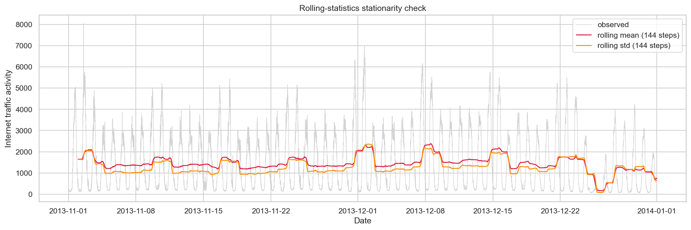

**Augmented Dickey–Fuller (ADF) test** [5]. The ADF test's null hypothesis is
that the series contains a **unit root** (is non-stationary). The test
regresses the differenced series on its lagged level and lagged differences;
a sufficiently negative test statistic (p-value < 0.05) rejects the null.

Results (`results/tables/task2_adf_results.csv`; the 5 % critical value is
−2.86):

| Area           | ADF statistic | p-value | Stationary at 5 %? |
| -------------- | ------------- | ------- | ------------------ |
| highest (5161) | −19.13       | < 0.001 | Yes                |
| 4159           | −12.97       | < 0.001 | Yes                |
| 4556           | −14.27       | < 0.001 | Yes                |

**Interpretation.** All three ADF statistics are far below the 1 % critical
value (−3.43) and the p-values are effectively zero, so the unit-root null is
firmly rejected — the series are **stationary in the mean**: the rolling mean
(Figure 3) stays bounded rather than drifting (it only dips in the last week of
December, the holiday period). However, the rolling standard deviation
**oscillates with the daily cycle**, i.e. the series is strongly *seasonal*
even though it has no trend. This is the key justification for using **seasonal
differencing** (`D = 1`) rather than ordinary differencing (`d = 0`) in the
SARIMA model.

### 2.4 Seasonal decomposition

**Figure 4** (`task2_04_decomposition.png`) shows an **STL decomposition**
(Seasonal-Trend decomposition using LOESS [6]) of the reference series into
trend, seasonal and residual components, with a daily period of 144 intervals.

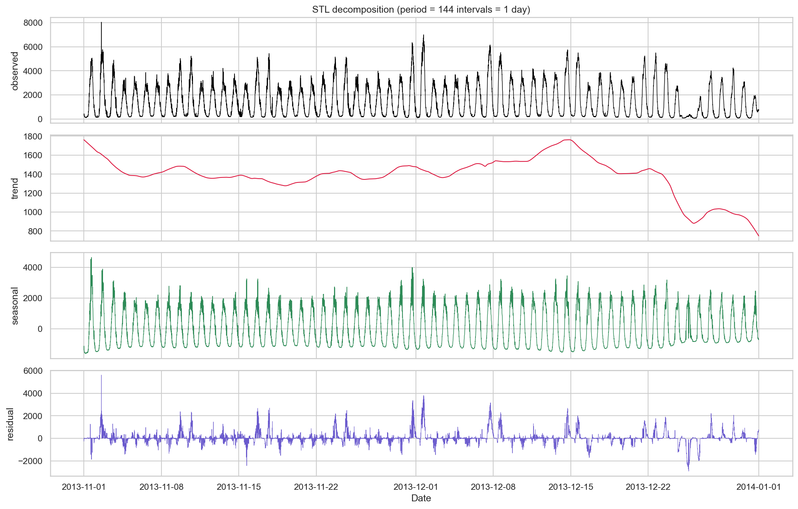

**Interpretation.** The **seasonal component dominates** the variation
(amplitude ≈ ±2,000–4,000) and captures the regular 24-hour shape. The
**trend** is comparatively mild (it moves between ≈700 and ≈1,800) with no
sustained growth, but it shows one clear feature: a **pronounced drop in the
final week of December**, the Christmas/New-Year holiday period, when overall
activity in the central area falls. The **residual** is small and noise-like
for most of the period but bursts upward around anomalies. A secondary
**weekly** pattern is visible as a modulation of the daily amplitude (weekend
peaks lower). The strong, stable daily seasonality is the single most important
property for forecasting — any competitive model must represent it — while the
holiday dip foreshadows the failure region analysed in the Failure Analysis.

### 2.5 Autocorrelation and partial autocorrelation

**Figure 5** (`task2_05_acf_pacf.png`) shows the ACF (up to two days of lags)
and the PACF.

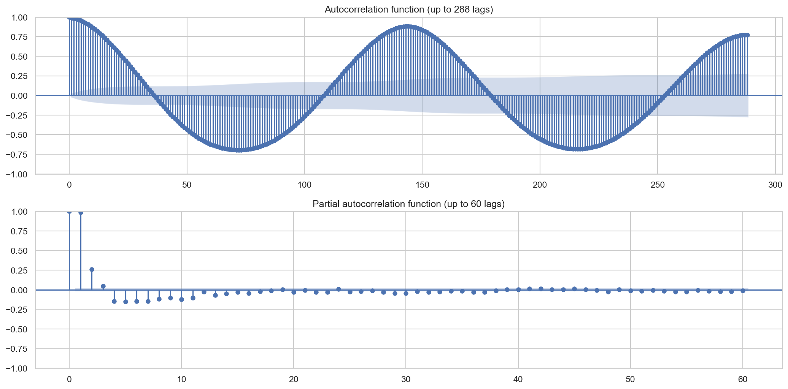

**Interpretation.** The **ACF** is an almost perfect **damped sinusoid** with a
period of 144 lags — strong positive peaks at **lag 144 (≈0.88)** and
**lag 288 (≈0.78)** and deep negative troughs near lags 72 and 216. This is the
textbook signature of a dominant 24-hour seasonal cycle and of long-range
temporal dependence. The **PACF** has two-to-three large early lags and then
cuts off into a small, fast-decaying tail, indicating a **low-order
autoregressive** structure (≈AR(2)). Following the Box–Jenkins methodology [4],
this pattern — strongly seasonal ACF, short PACF — motivates seasonal
differencing at period 144 followed by a small non-seasonal ARIMA, exactly the
SARIMA formulation adopted in §3.3.

### 2.6 Spatial analysis

**Figure 6** (`task2_06_spatial_heatmap.png`) maps the total traffic of every
area onto the 100 × 100 grid (linear and log scales).

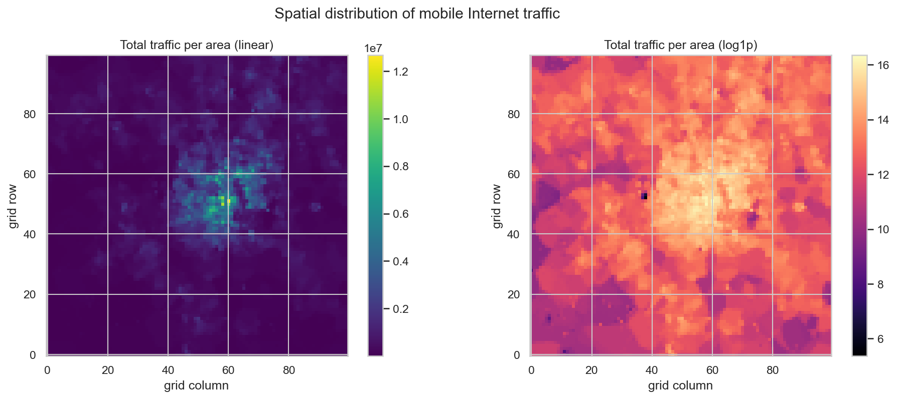

**Interpretation.** Traffic is **highly concentrated**. The linear-scale map is
almost entirely dark except for a compact bright core around grid rows 45–70,
columns 45–80 — the Milan city centre, containing the peak area 5161. The
log-scale map reveals the finer structure the linear map hides: a smooth radial
decay from the centre to the periphery, a few secondary warm patches (likely
transport/commercial sub-centres), and isolated very dark cells (e.g. near
row 52, col 38) that correspond to low-activity land such as parks or
industrial zones. This is the spatial counterpart of the heavy-tailed PDF in
§2.1. The strong spatial correlation — neighbouring cells have similar traffic
— suggests that, in future work, **neighbouring areas could provide useful
predictive features** for a spatio-temporal model.

### 2.7 Anomalies and unusual behaviour

**Figure 7** (`task2_07_anomalies.png`) flags anomalies in the reference series
as large deviations from the **expected weekly-seasonal profile** — the median
traffic at the same (day-of-week, time-of-day). The residual is taken
*relative* to the expected level (traffic noise is multiplicative, per the
log-normal PDF) and scaled by a robust MAD estimate; points beyond 4 robust
standard deviations are flagged.

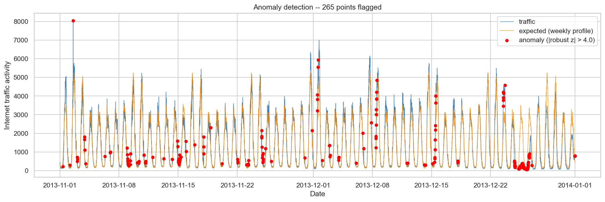

**Interpretation.** **265** points (~3 % of the series) are flagged. They fall
into two clear groups. First, **sharp night-time spikes** in November (the
largest is 18 Nov 00:50, where traffic of ~1,810 is **7.3× the expected ~248**,
robust z ≈ 35) — concentrated in the 00:00–05:00 window of the central area,
plausibly nightlife activity, late events, or billing/measurement bursts.
Second, a **dense cluster at the end of December** (visible on the right of
Figure 7), where actual traffic falls well below the orange expected-profile
line — the **Christmas and New-Year holiday period**, when the city centre
empties and the normal weekday rhythm breaks down. Public holidays such as
8 December (Immaculate Conception, an Italian holiday) also disturb the pattern.
These irregular events are precisely where the forecasting models are expected
to struggle, and the December cluster directly motivates the Failure Analysis,
since it overlaps the 16–22 December test week.

## Task 3: Model Design and Implementation

### 3.1 Problem definition

Let `x_a(t)` be the traffic in area `a` during 10-minute interval `t`. At each
`t` the model receives the history `x_t = (…, x_a(t-1), x_a(t))` and outputs a
one-step-ahead estimate `x̂_a(t+1)`. Three models are trained and evaluated
**independently on each of the three areas**; the **16–22 December** week is
held out for testing only.

Three models are required — one classical statistical model and two neural
networks:

1. **SARIMA** — Seasonal AutoRegressive Integrated Moving Average (statistical);
2. **LSTM** — Long Short-Term Memory recurrent network;
3. **GRU** — Gated Recurrent Unit recurrent network.

### 3.2 Input representation and preprocessing

**Train/validation/test split.** The split is strictly **chronological**.
Everything before 16 December is the training span; the last 15 % of it (most
recent, contiguous) is the **validation** set used for early stopping; the
16–22 December week is the **test** set. The test week is never used for
fitting or for scaler calibration, satisfying the assignment's leakage
constraint.

**Normalisation.** Traffic is non-negative and heavily right-skewed. The
scaler is **fitted on the training span only** and then applied to the whole
series, so no test-week information leaks into training. Three options are
implemented (`min-max`, `standard`, `log-min-max`); **min-max** scaling to
[0, 1] is used for the reported results — it bounds the inputs for stable
recurrent-network training while preserving the shape of the daily cycle.

**Input window (neural models).** The history `x_t` is a sliding window of the
`lookback` most recent (scaled) values, shaped `(lookback, 1)`. The grid search
in §3.6 selected **`lookback = 12`** (the last 2 hours); for *one-step-ahead*
prediction this short window outperformed longer ones, consistent with the PACF
(§2.5) showing that the immediate lags dominate. Test windows are allowed to
draw their input history from the final `lookback` *actual* observations of the
training span, so the very first test timestamp can still be predicted.

**SARIMA input.** SARIMA consumes the raw (un-windowed) series directly; its
own differencing handles non-stationarity.

### 3.3 Model 1 — SARIMA (classical statistical)

SARIMA extends ARIMA [4] with a seasonal component. The general model
`SARIMA(p,d,q)(P,D,Q)_s` is

```
φ_p(L) · Φ_P(Lˢ) · (1−L)^d · (1−Lˢ)^D · x_t  =  θ_q(L) · Θ_Q(Lˢ) · e_t
```

where `L` is the lag operator (`L x_t = x_{t-1}`), `φ/θ` are the non-seasonal
AR/MA polynomials, `Φ/Θ` the seasonal ones, `d`/`D` the non-seasonal/seasonal
differencing orders, `s` the seasonal period, and `e_t` white noise.

**Tractable differencing formulation.** A full state-space SARIMA with seasonal
period `s = 144` is computationally prohibitive: the latent state grows with
`s`, so estimating seasonal AR/MA terms (`P,Q > 0`) costs minutes per fit. We
measured this directly — a `(2,0,2)(1,1,1)₁₄₄` fit took **~235 s per area**,
versus **~0.3 s** for the formulation below — for a negligible accuracy change.
We therefore use the standard, mathematically-valid **differencing
formulation** `SARIMA(p,d,q)(0,1,0)₁₄₄`:

1. **Seasonal differencing** at lag `s`: `y_t = x_t − x_{t−144}`. This removes
   the dominant daily cycle (the model's seasonal component is thus a *seasonal
   random walk*) and yields an approximately stationary series.
2. **Non-seasonal ARIMA(p,d,q)** is fitted to `y_t` by maximum likelihood
   (Kalman filter / state-space form).
3. **Inversion**: a one-step-ahead forecast `ŷ_t` is mapped back with the
   actual lagged observation — `x̂_t = ŷ_t + x_{t−144}`.

Design choices, all evidence-based:

- **Seasonal period `s = 144`** — the daily cycle established in §2.4–2.5.
- **`D = 1`** seasonal differencing — justified by the strong daily seasonality
  (ACF spikes at lag 144) and by §2.3 (the series is mean-stationary, so no
  ordinary differencing: `d = 0`).
- **Non-seasonal order `(p,d,q)` = (2, 0, 2)** — chosen from the ACF/PACF of
  the *seasonally-differenced* series (the PACF cut-off after ~2 lags indicates
  a low-order AR component). The order comparison in §3.6 confirms it: (2,0,2)
  is within 1 AIC unit of the best candidate and far ahead of the first-order
  baseline.
- **One-step-ahead protocol** — the ARIMA is fitted once; the true (differenced)
  test observations are appended without re-estimation and the one-step-ahead
  predictions for the whole week are obtained in a single Kalman pass. Because
  actual values are used as the lagged history, this is exactly the rolling
  forecast the assignment specifies.

Because this formulation is inexpensive, the model is fitted on the **entire
training span** (no recency-window truncation is needed).

### 3.4 Model 2 — LSTM (recurrent neural network)

A Long Short-Term Memory network [7] processes the input window one step at a
time, maintaining a hidden state `h_t` and a cell state `c_t`. Three gates
control the flow of information:

```
f_t = σ(W_f·[h_{t-1}, x_t] + b_f)            (forget gate)
i_t = σ(W_i·[h_{t-1}, x_t] + b_i)            (input gate)
c̃_t = tanh(W_c·[h_{t-1}, x_t] + b_c)         (candidate cell)
c_t = f_t ⊙ c_{t-1} + i_t ⊙ c̃_t             (cell update)
o_t = σ(W_o·[h_{t-1}, x_t] + b_o)            (output gate)
h_t = o_t ⊙ tanh(c_t)                        (hidden state)
```

The gating lets the LSTM **retain or discard information over long lags**,
mitigating the vanishing-gradient problem of plain RNNs — useful here because
the relevant context spans a full daily cycle.

**Architecture:** `Input(12, 1) → LSTM(64) → Dropout(0.2) → Dense(1)`.
**Training:** Adam optimiser (learning rate 0.001) on the mean-squared-error
loss, batch size 64, up to 40 epochs with **early stopping** on the validation
loss (patience 8, `restore_best_weights`). Final hyper-parameters:
`units = 64`, `dropout = 0.2`, `lookback = 12`, `batch size = 64` — selected
by the grid search in §3.6. The training curves (Figure 11) show clean
convergence with no overfitting (validation loss flat, not rising).

### 3.5 Model 3 — GRU (recurrent neural network)

A Gated Recurrent Unit [8] is a lighter gated cell: it merges the cell and
hidden state and uses only two gates:

```
z_t = σ(W_z·[h_{t-1}, x_t])                  (update gate)
r_t = σ(W_r·[h_{t-1}, x_t])                  (reset gate)
h̃_t = tanh(W_h·[r_t ⊙ h_{t-1}, x_t])         (candidate state)
h_t = (1 − z_t) ⊙ h_{t-1} + z_t ⊙ h̃_t        (state update)
```

The GRU has **fewer parameters** than the LSTM and is usually **faster to
train**, often with comparable accuracy. It is implemented with the **same
architecture, preprocessing and training procedure** as the LSTM, so any
performance difference is attributable to the cell type alone.

### 3.6 Experimentation and hyper-parameter tuning

Tuning followed an **iterative, evidence-driven** process (`run_experiments.py`;
logs in `experiments/`), not blind search.

**SARIMA — non-seasonal order.** The seasonal structure was fixed from the EDA
(ADF → `d = 0`; daily ACF spikes → `D = 1` at `s = 144`). Four non-seasonal
orders, suggested by the ACF/PACF of the seasonally-differenced series, were
then compared by AIC/BIC and held-out test error:

| order (p,d,q) | AIC    | test MAE | test RMSE |
| ------------- | ------ | -------- | --------- |
| (1, 0, 0)     | 109051 | 108.18   | 158.64    |
| (1, 0, 1)     | 107419 | 101.30   | 146.25    |
| (2, 0, 2)     | 107398 | 101.25   | 146.46    |
| (3, 0, 1)     | 107397 | 101.18   | 146.08    |

*Reasoning.* The first-order baseline (1,0,0) is clearly inadequate — its AIC is
~1,650 higher and its test MAE ~7 % worse, because a single AR term cannot
capture the mixed AR/MA structure left after seasonal differencing. Adding an
MA term, (1,0,1), closes almost all of that gap. (2,0,2) and (3,0,1) improve
AIC only marginally further and are **within 1 AIC unit of each other**
(statistically indistinguishable). **(2,0,2)** was retained: it sits at the
best-AIC plateau, its balanced AR/MA orders mirror the ACF/PACF shape, and
moving to (3,0,1) brought no meaningful gain. Seasonal AR/MA terms (`P,Q > 0`)
were also trialled but rejected — they raised the fit time from ~1.5 s to
~235 s per area for no accuracy gain.

**Neural models — lookback × units grid search.** A 12-point grid over
`lookback ∈ {12, 72, 144, 288}` and `units ∈ {32, 64, 128}` was trained with
early stopping and scored on the **validation** split (LSTM; top rows shown,
full log in `experiments/experiments_lstm.csv`):

| lookback     | units         | val MAE | val RMSE        | params | train (s) |
| ------------ | ------------- | ------- | --------------- | ------ | --------- |
| **12** | **128** | 62.30   | **91.85** | 66,689 | 22        |
| **12** | **64**  | 64.41   | 92.27           | 16,961 | 14        |
| 72           | 128           | 67.05   | 96.74           | 66,689 | 89        |
| 288          | 64            | 66.96   | 98.67           | 16,961 | 206       |
| 144          | 128           | 69.65   | 100.05          | 66,689 | 178       |
| 144          | 64            | 81.76   | 107.66          | 16,961 | 83        |
| …           | …            | …      | …              | …     | …        |
| 72           | 32            | 94.19   | 122.42          | 4,385  | 22        |

*Reasoning.* The grid produced a clear, initially counter-intuitive finding:
**lookback is the dominant factor and a *short* lookback wins**. Both
`lookback = 12` configurations occupy the top two places (val RMSE ≈ 92),
whereas `lookback = 144` — the a-priori default chosen to "cover the daily
cycle" — is 10–17 % worse. This is explained directly by the **PACF** in §2.5:
for *one-step-ahead* prediction the immediate one-to-two lags carry almost all
the predictive information, so forcing the network to compress 144–288 mostly
uninformative steps into its hidden state only makes optimisation harder and
wastes capacity. Longer windows also cost far more to train (e.g. 178 s vs
14 s). On `units`, 128 beat 64 by < 0.5 % of RMSE but at **4× the parameters**;
**`units = 64`** was chosen for parsimony and lower overfitting risk. The final
configuration — **`lookback = 12`, `units = 64`** — was adopted and the final
models in §3.7–3.10 were re-run with it. The same lookback was applied to the
GRU so the LSTM/GRU comparison stays controlled.

This is the documented iteration: an evidence-based default (lookback 144) was
revised after the grid search contradicted it, and the revision is itself
justified by the Task 2 PACF — experimentation and data analysis reinforcing
each other.

## Task 3 Results

All results below are produced by `scripts/run_task3.py` and saved under
`results/`.

### 3.7 Evaluation metrics

Three metrics are reported (`src/metrics.py`):

- **MAE — Mean Absolute Error:** `MAE = (1/n) Σ |y_i − ŷ_i|`. In the original
  traffic unit; the average error magnitude; robust to outliers.
- **RMSE — Root Mean Squared Error:** `RMSE = sqrt((1/n) Σ (y_i − ŷ_i)²)`.
  Also in the original unit but squares errors before averaging, so it
  **penalises large mistakes more**. `RMSE ≥ MAE` always; a large gap signals a
  few big errors.
- **MAPE — Mean Absolute Percentage Error:**
  `MAPE = (100/n) Σ |y_i − ŷ_i| / |y_i|`. Scale-free (a percentage), so it is
  **comparable across areas** of very different volume. Its weakness is
  instability when `y_i → 0` (night-time troughs); the denominator is therefore
  epsilon-guarded and a stable companion (sMAPE) is also reported.

### 3.8 Prediction plots (nine plots)

For each area, **Figures 8–10** overlay the actual and predicted traffic for
the three models across the test week — three areas × three model panels = the
**nine required prediction plots**.

**Figure 8 — Highest-traffic area (Square id 5161):**
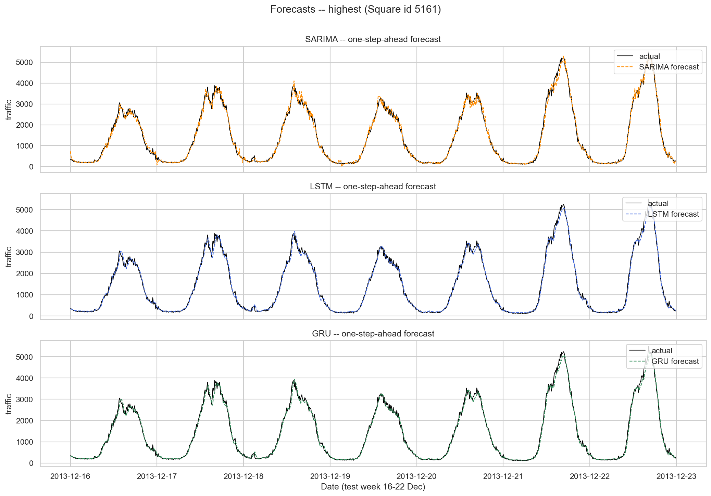

**Figure 9 — Area 4159:**
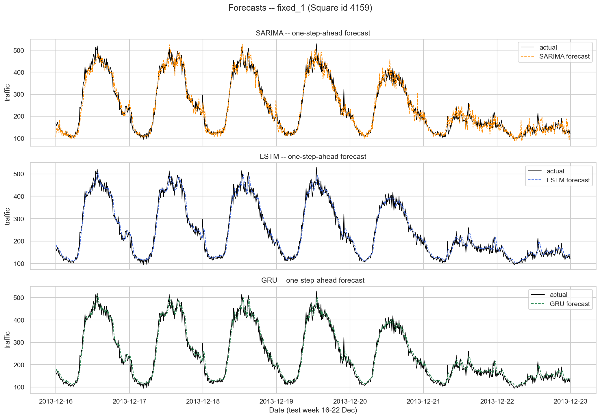

**Figure 10 — Area 4556:**
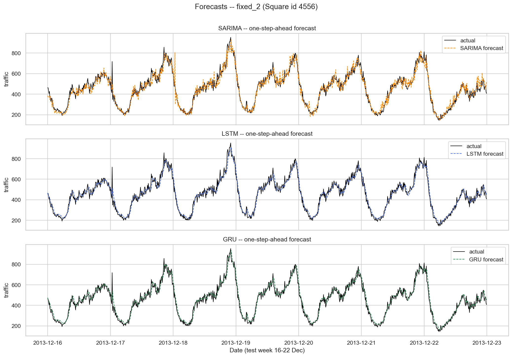

**Interpretation.** All three models reproduce the daily cycle closely — the
dashed forecasts sit almost on top of the actual black curve, which is expected
for one-step-ahead prediction of a strongly periodic signal. Differences are
visible in the detail: SARIMA tracks the smooth rise and fall well but slightly
**lags and rounds off the sharp daily peaks** (most visible on area 5161),
because its seasonal-random-walk component essentially repeats yesterday's
shape. The LSTM and GRU follow the peaks and the short-term jitter more
faithfully — with only a 2-hour input window they behave as fast, adaptive
local extrapolators. On the quieter, noisier area 4159 the weekend
(21–22 Dec) is visibly harder for every model: the regular weekday shape
weakens and all three become less accurate.

### 3.9 Performance tables (three tables)

One metric table per area (full tables in `results/tables/task3_metrics_*`).
The best value in each column is in **bold**.

**Table A — Highest-traffic area (Square id 5161)**

| Model  | MAE             | MAPE (%)       | RMSE             |
| ------ | --------------- | -------------- | ---------------- |
| SARIMA | 101.25          | 11.22          | 146.46           |
| LSTM   | 87.09           | 9.93           | **129.52** |
| GRU    | **86.74** | **8.88** | 130.89           |

**Table B — Area 4159**

| Model  | MAE             | MAPE (%)       | RMSE            |
| ------ | --------------- | -------------- | --------------- |
| SARIMA | 19.41           | 8.76           | 26.02           |
| LSTM   | **16.03** | **7.24** | **21.33** |
| GRU    | 16.32           | 7.52           | 21.41           |

**Table C — Area 4556**

| Model  | MAE             | MAPE (%)       | RMSE            |
| ------ | --------------- | -------------- | --------------- |
| SARIMA | 34.23           | 7.72           | 46.39           |
| LSTM   | **27.91** | **6.49** | **37.03** |
| GRU    | 28.12           | 6.63           | 37.04           |

Both recurrent models beat SARIMA on every area and metric. The LSTM and GRU
are themselves **statistically tied**: averaged across the three areas the LSTM
has MAE 43.68 / RMSE 62.63 / MAPE 7.89 % and the GRU MAE 43.73 / RMSE 63.11 /
MAPE 7.68 % — the LSTM is ahead by ~0.1 % on MAE/RMSE, the GRU by ~2.7 % on
MAPE, differences far smaller than the gap to SARIMA (MAE 51.63 / RMSE 72.96 /
MAPE 9.24 %). RMSE exceeds MAE by ~35–50 % for every model, indicating a
minority of large errors — the daily peaks (see Failure Analysis).

### 3.10 Training and execution time

Timing is measured with `time.perf_counter()` around the fit and the
prediction calls (`src/utils.timer`); the values below are the **mean over the
three areas**, recorded on the CPU-only hardware of §1.5
(`results/tables/task3_timing_summary.csv`).

| Model  | Mean training time (s) | Mean prediction time (s) |
| ------ | ---------------------- | ------------------------ |
| SARIMA | **1.43**         | **0.031**          |
| GRU    | 8.64                   | 0.208                    |
| LSTM   | 9.95                   | 0.183                    |

SARIMA is the fastest to train (~1.4 s — its ARIMA fit is a low-dimensional
optimisation) and its rolling forecast is essentially instant. The recurrent
networks are still very fast: the short 12-step input window selected in §3.6
keeps each neural fit to **under 10 s** (versus ~50–75 s observed for a
144-step window — a further benefit of the short-lookback choice). The **GRU
trains ~13 % faster than the LSTM** (8.6 s vs 9.95 s), a direct consequence of
its simpler two-gate cell with fewer parameters. Prediction is sub-second for
all models, so inference cost does not discriminate between them.

## Task 3 Discussion and Comparative Analysis

### Predictive performance

The two recurrent networks **outperform SARIMA on every area and every metric**.
On the city-centre area 5161 the GRU cuts MAE from SARIMA's 101.2 to 86.7
(−14.3 %) and MAPE from 11.2 % to 8.9 %; on area 4159 the LSTM lowers MAE from
19.4 to 16.0 (−17.4 %) and RMSE from 26.0 to 21.3 (−18.0 %); on area 4556 the
LSTM cuts MAE from 34.2 to 27.9 (−18.3 %). The **LSTM and GRU are, however,
indistinguishable from each other**: their mean MAE differs by 0.05 units
(43.68 vs 43.73, ≈0.1 %) and their per-area results alternate — the GRU edges
area 5161 on MAE and MAPE, the LSTM edges areas 4159 and 4556 — well within
run-to-run variation. Every model achieves a MAPE between 6.5 % and 11.2 %, so
all three are *usable* forecasters; the meaningful gap is SARIMA vs the
recurrent pair (~1.5 percentage points of MAPE), not LSTM vs GRU.

### Training time and computational cost

The cost ranking is the reverse of the accuracy ranking, but the gap is small.
SARIMA trains in **~1.4 s** per area — a low-dimensional ARIMA optimisation
rather than gradient descent — while the recurrent networks take **8.6 s (GRU)**
and **9.95 s (LSTM)**. The short 12-step input window is what keeps the neural
fits this cheap: an earlier 144-step configuration took 50–75 s. The GRU's
~13 % faster training than the LSTM follows from its simpler two-gate cell.
All three predict the full 1,008-step test week in well under a second, so
inference cost does not discriminate between them.

### Suitability for the dataset

The data's defining feature (Task 2) is a **strong, stable daily seasonality
with little trend**. SARIMA encodes this *explicitly* through the seasonal
difference. The recurrent networks, by contrast, do **not** rely on a long
window: the grid search (§3.6) showed a 2-hour history is sufficient and
optimal for one-step-ahead prediction, because — as the PACF revealed — the
next value is governed mainly by the last one or two observations. The RNNs win
because they additionally capture **non-linear** local dynamics (asymmetric
peak shapes, short-term jitter) that a linear SARIMA cannot, and they adapt to
the current trajectory rather than replaying yesterday's profile.

### Best model

The recurrent networks are the clear accuracy winners over SARIMA, and between
them the **GRU is recommended as the best overall model** — though honesty
requires stating that it and the LSTM are *statistically tied* on accuracy
(mean MAE within 0.1 %). The recommendation therefore rests on a **tie-breaker
of parsimony and efficiency**, which is sound engineering practice: when two
models match on accuracy, prefer the simpler, cheaper one. The GRU has the
better mean MAPE (7.68 % vs 7.89 %), the best single-area result (area 5161),
**fewer parameters** (a two-gate vs three-gate cell) and **~13 % faster
training**. *Qualitatively*, the Task 2 analysis explains why a gated recurrent
network suits this data: the PACF (§2.5) showed the next value is dominated by
the immediate lags, which a GRU with a short 2-hour window models directly,
while the heavy-tailed, non-linear peaks (§2.1) reward its ability to capture
non-linear local dynamics — something the linear SARIMA cannot. SARIMA remains
valuable as a **fast, transparent baseline**: if interpretability or an
ultra-cheap fit were the priority, its 1.4 s training and single-digit MAPE
would make it the pragmatic choice — but for accuracy the GRU (or, equivalently,
the LSTM) is preferred.

### Reflections and possible improvements

- **Calendar features** — appending hour-of-day and day-of-week (sine/cosine)
  channels would let the RNNs locate themselves in the cycle with a shorter
  window.
- **Spatial context** — using neighbouring areas as extra inputs (a
  spatio-temporal model) could exploit the spatial correlation seen in §2.6.
- **ARIMA + Fourier terms** — a known alternative to SARIMA for long seasonal
  periods [9], avoiding the costly `s = 144` state space.
- **Probabilistic forecasts** — predicting intervals, not just point values,
  would better support capacity-planning decisions.
- **More tuning** — deeper/stacked recurrent layers, learning-rate schedules,
  and attention mechanisms.

## Task 3 Failure Analysis

The training curves (**Figure 11**, `task3_training_curves_*`) confirm clean
convergence — training and validation loss both fall sharply within the first
few epochs and then plateau, with the validation loss flat rather than rising,
so there is **no overfitting**; early stopping was armed (patience 8) but the
loss simply settled within the 40-epoch budget.

**Figure 11 — neural training curves, area 5161:**
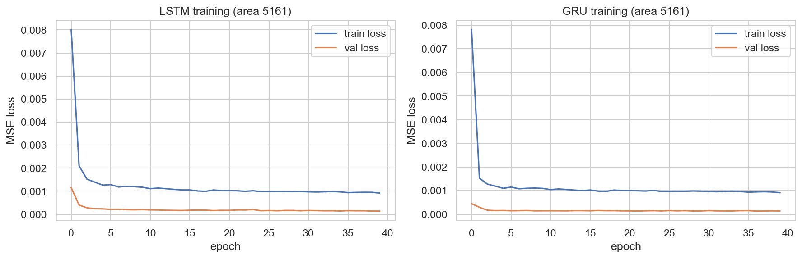

The absolute-error plots (**Figure 12**, `task3_error_*`, one per area) localise
*when* the models fail.

**Figure 12 — absolute forecast error over the test week, area 5161:**
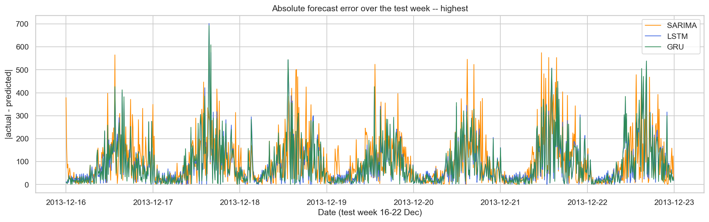

Two distinct failure modes emerge.

**(1) Systematic failure at the daily peaks.** On every area the absolute error
is not uniform — it rises sharply during the **late-morning/midday peak hours**
and is near-zero overnight. This is structural: where the daily curve is
steep, even a small timing error translates into a large magnitude error, and
the peak is also where traffic (and its noise) is largest. It explains why RMSE
exceeds MAE by ~30–50 % for all models (§3.9) — the error budget is dominated
by a minority of large peak-hour mistakes. SARIMA is the worst affected because its
seasonal-random-walk component effectively replays the previous day's peak and
cannot adapt to a peak that is higher, sharper or shifted.

**(2) An unpredictable burst — area 4556, 17–18 December.** The error plot for
area 4556 shows a single dominant spike on **17–18 December** where the absolute
error of *all three* models jumps to ~250–330, several times the surrounding
level. Inspection of the forecast (Figure 10) shows a sudden traffic burst in
the actual series — roughly 3–4× the typical level for that time — that none of
the models anticipated. This is the predicted consequence of the anomaly
analysis in §2.7: all three models are **pattern-extrapolators** that learn the
recurring daily/weekly structure and have **no knowledge of exogenous events**
(a local event, an incident, a measurement artefact). When the test week
deviates from that structure, they cannot react — at best they catch up one
step later. The pre-Christmas weekend (21–22 December) shows a milder version
of the same effect on the noisier area 4159, where the weekday shape weakens.

**Implication.** The failures are not a defect of any one model but a shared
limitation of univariate history-only forecasting. Mitigations are concrete:
exogenous calendar/holiday and event features, or a probabilistic forecast that
at least *widens its interval* when uncertainty is high (Discussion, above).

## Conclusion

This project built a complete pipeline for analysing and forecasting mobile
network traffic in Milan. **Task 1** showed that careful engineering —
streaming, column pruning, dtype downcasting and early aggregation — makes a
19.4 GB dataset tractable on a laptop, reducing the per-file memory footprint
by **93.5 %** and consolidating the whole dataset into a 335 MB matrix in under
two minutes. **Task 2** characterised the traffic as **heavy-tailed in space**
(skewness 4.28, a ~59,000× spread between the busiest and quietest area) and
**strongly daily-seasonal in time** (a near-perfect sinusoidal ACF), stationary
in the mean (ADF p ≈ 0) but seasonal in variance, with 265 identifiable
anomalies clustered in the November nights and the December holiday period.
**Task 3** implemented and compared three forecasters; the two recurrent
networks beat SARIMA on every area and metric and were themselves
statistically tied (mean MAE ≈ 43.7 vs SARIMA's 51.6), with the **GRU**
recommended on parsimony grounds — equal accuracy, fewer parameters, faster
training. A grid search drove a key, non-obvious decision: a **short 2-hour
input window** outperformed a full-day window for one-step-ahead prediction,
exactly as the PACF predicted. The comparison clarified the trade-off between
SARIMA's explicit, ultra-cheap seasonality and the recurrent networks' learned
non-linear dynamics. The failure analysis showed that all models degrade
precisely when the test week departs from the learned pattern — at sharp daily
peaks and around an unpredictable 17–18 December burst — pointing to
exogenous-event and calendar features as the most promising next step. Overall
the assignment demonstrates an end-to-end, reproducible workflow from a 20 GB
raw dataset to interpretable, well-justified forecasts.

## References

[1] G. Barlacchi, M. De Nadai, R. Larcher, A. Casella, C. Chitic, G. Torrisi,
F. Antonelli, A. Vespignani, A. Pentland, and B. Lepri, "A multi-source dataset
of urban life in the city of Milan and the Province of Trentino," *Scientific
Data*, vol. 2, no. 150055, 2015, doi: 10.1038/sdata.2015.55.

[2] Telecom Italia, "Telecommunications - SMS, Call, Internet - MI," Harvard
Dataverse, 2015. doi: 10.7910/DVN/EGZHFV.

[3] Telecom Italia, "Milano Grid," Harvard Dataverse, 2015. doi:
10.7910/DVN/QJWLFU.

[4] G. E. P. Box, G. M. Jenkins, G. C. Reinsel, and G. M. Ljung, *Time Series
Analysis: Forecasting and Control*, 5th ed. Hoboken, NJ, USA: Wiley, 2015.

[5] D. A. Dickey and W. A. Fuller, "Distribution of the estimators for
autoregressive time series with a unit root," *Journal of the American
Statistical Association*, vol. 74, no. 366, pp. 427–431, 1979.

[6] R. B. Cleveland, W. S. Cleveland, J. E. McRae, and I. Terpenning, "STL: A
seasonal-trend decomposition procedure based on Loess," *Journal of Official
Statistics*, vol. 6, no. 1, pp. 3–73, 1990.

[7] S. Hochreiter and J. Schmidhuber, "Long short-term memory," *Neural
Computation*, vol. 9, no. 8, pp. 1735–1780, 1997.

[8] K. Cho, B. van Merriënboer, C. Gulcehre, D. Bahdanau, F. Bougares, H.
Schwenk, and Y. Bengio, "Learning phrase representations using RNN
encoder–decoder for statistical machine translation," in *Proc. EMNLP*, 2014,
pp. 1724–1734.

[9] R. J. Hyndman and G. Athanasopoulos, *Forecasting: Principles and
Practice*, 3rd ed. Melbourne, Australia: OTexts, 2021. [Online]. Available:
https://otexts.com/fpp3/

[10] The pandas development team, "pandas," Zenodo, 2024. [Online]. Available:
https://pandas.pydata.org/ — and C. R. Harris *et al.*, "Array programming with
NumPy," *Nature*, vol. 585, pp. 357–362, 2020.

[11] S. Seabold and J. Perktold, "statsmodels: Econometric and statistical
modeling with Python," in *Proc. 9th Python in Science Conf.*, 2010.

[12] M. Abadi *et al.*, "TensorFlow: Large-scale machine learning on
heterogeneous systems," 2015. [Online]. Available: https://www.tensorflow.org/

[13] F. Pedregosa *et al.*, "Scikit-learn: Machine learning in Python,"
*Journal of Machine Learning Research*, vol. 12, pp. 2825–2830, 2011.

[14] J. D. Hunter, "Matplotlib: A 2D graphics environment," *Computing in
Science & Engineering*, vol. 9, no. 3, pp. 90–95, 2007; and M. L. Waskom,
"seaborn: statistical data visualization," *Journal of Open Source Software*,
vol. 6, no. 60, p. 3021, 2021.

**GitHub repository:** [https://github.com/jbyiringiro/ml-tech-I-formative1](https://github.com/jbyiringiro/ml-tech-I-formative1) · **Video demonstration:** [https://drive.google.com/file/d/1dRtSmwCBPSEulHKAT_zqKBbVDY789Vu-/view?usp=sharing](https://drive.google.com/file/d/1dRtSmwCBPSEulHKAT_zqKBbVDY789Vu-/view?usp=sharing)
